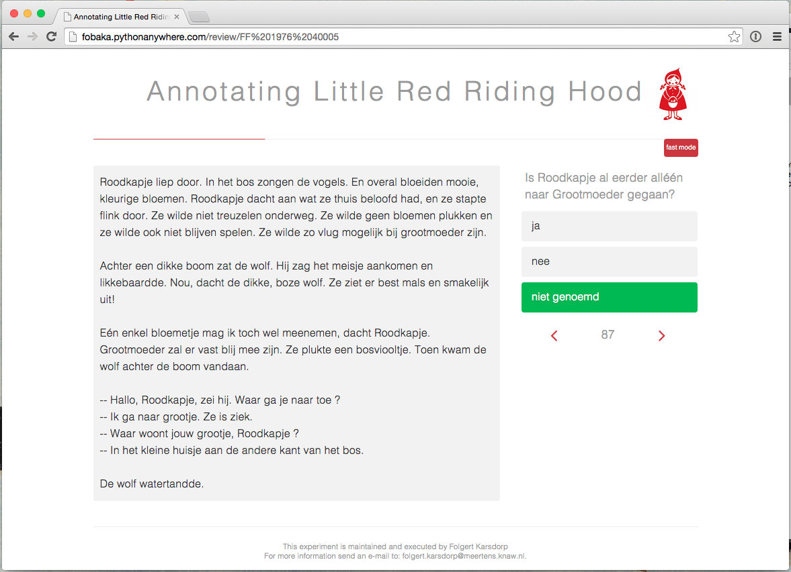

# Installation

To run the annotation app, first create and populate the database, using:

    python db_create.py
    python db_migrate.py
    python fill_database.py
    python question_tree.py

After that, start the application using:

    python run.py

And direct your browser to http://localhost:5000

